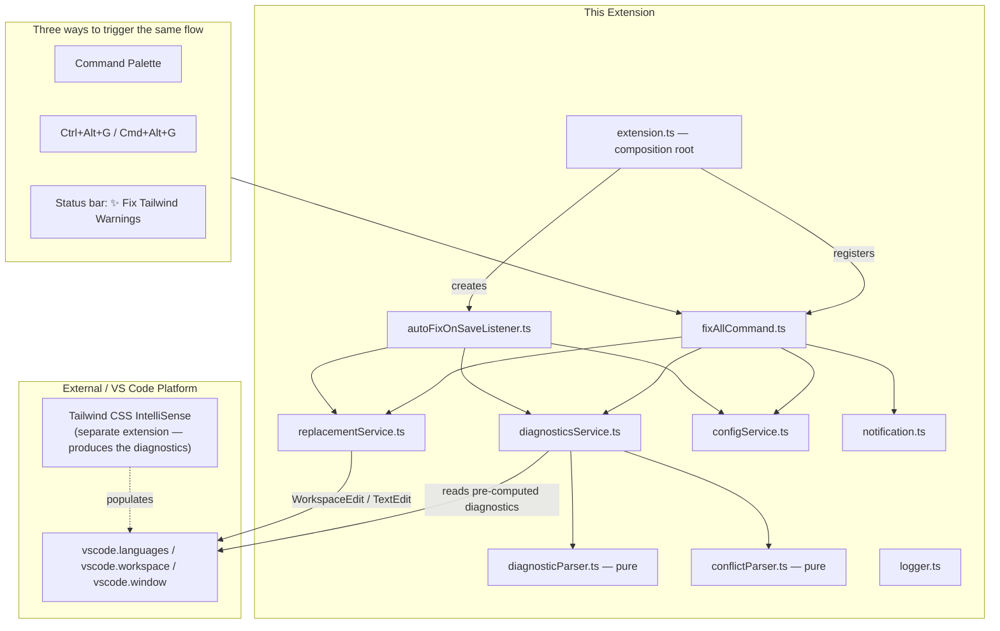
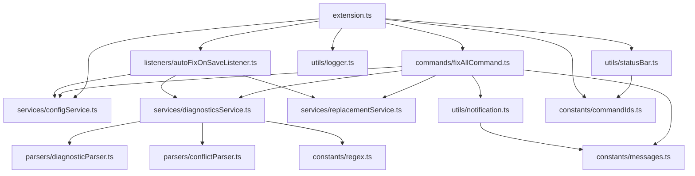

# DEVELOPER.md — Tailwind Warning Auto-Fix Technical Handbook

> Written for the returning maintainer. Read this before touching the code. It explains the *why*, not just the *what*.
>
> A note on this codebase specifically: it's unusually well self-documented already — nearly every file has substantial doc-comments explaining *why*, not just *what*, and the `README.md`/`CHANGELOG.md` are both detailed and accurate. This handbook adds the cross-file reasoning, verified behavior, and a few concrete gaps that aren't spelled out anywhere else, rather than re-explaining what the source comments already say well.

---

## 1. Project Overview

**Tailwind Warning Auto-Fix** is a VS Code extension that batch-resolves the diagnostics produced by the **Tailwind CSS IntelliSense** extension — it does not itself understand Tailwind, CSS, or JSX. Tailwind CSS IntelliSense flags two distinct things in the Problems panel: **optimization opportunities** (a class can be rewritten to an equivalent, shorter/canonical form, e.g. `max-w-[1600px]` → `max-w-400`) and **class conflicts** (two classes set the same CSS property, so only one actually takes visual effect, e.g. `text-left` vs `text-center`). Normally, resolving either requires opening the lightbulb Quick Fix menu one class at a time. This extension reads every such diagnostic already present in the active file and resolves all of them in one command: optimizations are rewritten automatically (after one confirmation), and conflicts are resolved interactively, one decision per **unique pair** of conflicting class names — everything is applied together as a single atomic edit with one Undo.

**Primary purpose:** eliminate the "click the lightbulb 40 times" tedium of applying Tailwind IntelliSense's own suggestions in a file with many warnings, while being deliberately conservative about the one category (conflicts) where an automatic choice could silently change how the page renders.

**Major capabilities:**
- `Tailwind: Fix All Warnings` — one command, three entry points (Command Palette, `Ctrl+Alt+G`/`Cmd+Alt+G`, or a status bar button), that fixes every optimization warning and walks through every class conflict in the active file.
- **Auto Fix on Save** (opt-in) — optimization warnings only, folded into the save operation itself, completely silent.
- A configurable conflict-resolution strategy: interactive (default), or fully automatic (`keepFirst`/`keepLast`, explicitly documented as an accuracy trade-off), or `skip`.
- Works in any language Tailwind CSS IntelliSense supports, with no hardcoded language list — it works entirely off `vscode.languages.getDiagnostics()`, never scanning document text or building an AST itself.

**Overall architecture:** a standard VS Code extension (TypeScript, compiled to CommonJS, `vscode` API only — no runtime npm dependencies beyond the `vscode` typings). The entire design rests on one constraint stated repeatedly throughout the source: **this extension never re-implements Tailwind's logic** — it is a thin automation layer that reads diagnostics another extension already computed, parses their message text with two small regexes, and turns them into precise, range-based `WorkspaceEdit`s.

**Technologies used:** TypeScript (strict mode, `noImplicitAny`, `noUnusedLocals`/`noUnusedParameters`, no `any` allowed by ESLint config), compiled via `tsc` to `out/`, packaged with `@vscode/vsce`, optionally published to Open VSX via `ovsx`. No frontend framework, no bundler (no webpack/esbuild step — `tsc` output is used directly as `main`).

**High-level design philosophy:** small, single-responsibility modules (`parsers/` are pure functions with zero `vscode` imports; `services/` hold all `vscode` API interaction; `commands/` orchestrate; `utils/` are thin UI/logging wrappers) wired together via manual dependency injection from one composition root (`extension.ts`), explicitly to keep every piece independently testable even though no test suite exists yet (see [§24 Technical Debt](#24-technical-debt)). Safety is prioritized over convenience in exactly one place — conflict resolution — and the codebase is unusually explicit, in comments, about *why* that specific line is drawn there.

---

## 2. Repository Structure

```
tailwind-warning-auto-fix/
├── src/
│   ├── extension.ts                 # Composition root: activate()/deactivate()
│   ├── commands/
│   │   └── fixAllCommand.ts           # Orchestrates the entire "Fix All Warnings" flow
│   ├── services/
│   │   ├── diagnosticsService.ts        # Reads + filters + parses raw vscode.Diagnostic[]
│   │   ├── replacementService.ts          # Builds and applies WorkspaceEdit/TextEdit[]
│   │   └── configService.ts                # Typed wrapper over the extension's settings
│   ├── parsers/
│   │   ├── diagnosticParser.ts               # Pure regex parse: optimization messages
│   │   └── conflictParser.ts                  # Pure regex parse: conflict messages
│   ├── listeners/
│   │   └── autoFixOnSaveListener.ts             # onWillSaveTextDocument + waitUntil
│   ├── utils/
│   │   ├── notification.ts                       # vscode.window.show* wrappers
│   │   ├── statusBar.ts                            # The status bar button
│   │   └── logger.ts                                # OutputChannel-backed logger
│   ├── types/
│   │   └── diagnosticTypes.ts                         # Shared interfaces across all layers
│   └── constants/
│       ├── regex.ts, messages.ts, commandIds.ts         # The only places these are defined
├── out/                              # Compiled JS + source maps (tsc output; gitignored — see note below)
├── package.json                      # Extension manifest: commands, keybindings, settings, scripts
├── CHANGELOG.md                      # Detailed, accurate, version-by-version history — read this for "why does X exist"
└── README.md                         # Extensive user-facing docs; largely accurate as of this handbook
```

### A note on this specific archive vs. the actual git repository
This upload includes several files that are **not tracked in git** (confirmed via `git ls-files`): the entire `out/` directory and four `.vsix` package files (`tailwind-warning-auto-fix-0.0.1.vsix` through `-0.4.2.vsix`), all correctly excluded by `.gitignore` (`out`, `dist`, `*.vsix`) but present here because this archive was zipped directly from a working directory rather than exported via `git archive`. Two things worth knowing as a result:
- **`out/commands/` contains both `fixAllCommand.js` *and* `autoFixCommand.js`**, but `src/commands/` contains only `fixAllCommand.ts`. This isn't a mismatch in the current source — `autoFixCommand.js` is **stale, orphaned compiled output** left over from before version 0.2.0's "consolidate into a single command" change (see `CHANGELOG.md`'s 0.2.0 and 0.1.0 entries — the project originally had two separate commands, `Tailwind: Auto Fix Optimization Warnings` and `Tailwind: Resolve Class Conflicts`, later merged into the one `fixAllCommand.ts` seen today). Nothing in current `extension.js`/`fixAllCommand.js` references it; it's simply a leftover file from a `tsc` run that predates a source file being deleted, and `tsc` doesn't clean up outputs for deleted inputs on its own. Re-running `npm run compile` against a freshly emptied `out/` would remove it.
- **The four bundled `.vsix` files are historical build artifacts**, one per released version — useful as a local install/rollback option (`code --install-extension <file>.vsix`) but not something to treat as current source of truth for behavior; always check `src/` against the version number in `package.json` instead.

### `src/parsers/`
**Why it's separated from `src/services/`:** these two files are the only ones in the entire codebase with **zero `vscode` imports** — each takes a raw string and returns a parsed result or `null`, deterministically, with no side effects. This is what the extensive doc-comments mean by "pure" — it's what would make these two files trivially unit-testable without any VS Code test harness, the moment a test suite is added (see [§24](#24-technical-debt)).

### `src/services/`
**Why the three-way split (`diagnosticsService`/`replacementService`/`configService`):** each owns exactly one `vscode` API surface — `diagnosticsService.ts` only ever calls `vscode.languages.getDiagnostics()`, `replacementService.ts` only ever builds/applies `WorkspaceEdit`/`TextEdit`, `configService.ts` only ever calls `vscode.workspace.getConfiguration()`. This means any given bug (e.g., "a setting isn't being read correctly" vs. "an edit range is wrong") has exactly one file it could possibly be in.

### `src/commands/`
**Why there's only one file here despite the folder being plural:** `fixAllCommand.ts` is the sole surviving command after the 0.2.0 consolidation (see the note above); the folder structure (plural, matching `services/`/`parsers/`/etc.) was set up when there were two commands and simply wasn't renamed to singular after the merge — a purely cosmetic leftover, not a functional issue.

---

## 3. Architecture Overview



**Major layers, and the one rule that shapes everything:** "read diagnostics that already exist; never scan document text; never build an AST." This single constraint (stated in nearly every file's doc-comment) is why the architecture is as simple as it is — there's no parser for Tailwind classes, no CSS specificity engine, no JSX/HTML tokenizer anywhere in this codebase. The entire "intelligence" of the extension is delegated to Tailwind CSS IntelliSense; this extension's own logic is limited to two regexes and range-based text edits.

**Dependency direction:** `extension.ts → commands/listeners → services → parsers/utils`, strictly one-directional. `parsers/` depend on nothing (not even `vscode`). This is explicitly called out in `extension.ts`'s own doc-comment as "manual DI" — every module receives its dependencies (`Logger`, `ConfigService`) as constructor/function parameters rather than importing a global singleton, specifically so each module *could* be unit-tested in isolation by passing in a fake/stub.

**Important abstraction — the overlap guard (`excludeOverlapping` in `replacementService.ts`):** every single edit-producing code path in the entire extension (single-command optimization replace, conflict removal, the combined fix, and the save-time edit builder) routes through this one private function. It sorts candidate edits by document position and rejects any whose range overlaps an already-accepted one, deterministically preferring the earlier one. This is the one piece of "safety-critical" logic in the codebase, and it being centralized in exactly one place (rather than reimplemented per edit path) is a deliberate, well-executed design choice.

---

## 4. Execution Flow

### Extension activation (`src/extension.ts`)
1. `activationEvents: ["onStartupFinished"]` in `package.json` means `activate()` runs automatically shortly after VS Code finishes loading — **not** lazily on first command invocation. This is a deliberate change from an earlier version (see `CHANGELOG.md`'s 0.3.0 entry): under lazy (`onCommand`-only) activation, the status bar button wouldn't exist, and the Auto Fix on Save listener wouldn't be registered, until *after* the user had already run the command manually at least once — which would silently defeat the entire purpose of both an always-visible status bar button and an automatic save-triggered feature.
2. `activate()` constructs exactly two concrete objects — a `Logger` and a `ConfigService` — and passes them down to everything else. This function is the **only** place in the codebase that instantiates concrete classes, calls `vscode.commands.registerCommand`/`vscode.workspace.onWillSaveTextDocument`, or touches `context.subscriptions`. Every other file receives what it needs as a parameter.
3. Three `Disposable`s (the command registration, the status bar item, the save listener) plus the `Logger` itself (which wraps a disposable `OutputChannel`) are all pushed into `context.subscriptions`, so VS Code cleans all of them up automatically on deactivation — which is why `deactivate()` is deliberately empty.

### Command execution (`Tailwind: Fix All Warnings`, from any of its three entry points)
All three entry points (Command Palette, keybinding, status bar click) invoke the exact same registered command, so there is only one code path to trace — see [§5](#5-request-lifecycle).

### Auto Fix on Save (if enabled)
Fires on every `onWillSaveTextDocument` event, for every document, regardless of the setting — the enabled/disabled check happens *inside* the handler (see [§9](#9-api-documentation)), not by conditionally registering the listener. This means the listener is always attached once the extension is active; toggling the setting just changes what it does when it fires, not whether it fires at all.

---

## 5. Request Lifecycle

There's no HTTP/server request cycle here — the closest equivalent is the "Fix All Warnings" command's internal pipeline, traced in full since it's the one piece of real business logic in the extension:

```
User triggers the command (any of 3 entry points)
    ↓
runFixAllCommand() — src/commands/fixAllCommand.ts
    ↓
Guard: is there an active editor? → if not, "Open a file first." and stop
    ↓
scanTailwindDiagnostics(document)     — optimization warnings
scanTailwindConflicts(document)       — conflict warnings (run in parallel conceptually; both against the SAME untouched document)
    ↓
Guard: zero total warnings found? → "No Tailwind warnings found." and stop
    ↓
If optimization warnings exist AND confirmBeforeApply is true:
    → show ONE confirmation dialog covering all optimizations
    → if cancelled, stop entirely (no conflicts are resolved either)
    ↓
Resolve conflicts per configService.getConflictResolutionStrategy():
    "ask"        → one Quick Pick per UNIQUE (classA, classB) pair, reused for all repeats of that pair
    "keepFirst"  → automatic: keep whichever class's range starts earlier in the document
    "keepLast"   → automatic: keep whichever class's range starts later
    "skip"       → every conflict left untouched
    ↓
applyCombinedFixes() — ONE WorkspaceEdit containing every replacement AND every removal,
    all computed against ranges captured from the ORIGINAL (pre-edit) document
    ↓
Overlap guard runs across BOTH categories combined — any two edits whose ranges
    intersect, the later one (by document position) is excluded, not applied
    ↓
vscode.workspace.applyEdit() — atomic; one Undo reverts everything
    ↓
If showSummary is true: one notification, e.g. "18 optimizations fixed, 2 conflicts resolved. 3 warnings skipped."
```

**Why the confirmation-cancel behavior stops the *entire* command, not just optimizations:** if the user cancels the optimization confirmation, `runFixAllCommand` returns immediately — conflicts that were already scanned are never presented for resolution in that run. This is a reasonable "cancel means cancel" interpretation, but worth knowing: there's no way to skip only the optimization step while still resolving conflicts in the same invocation; the user would need to disable `confirmBeforeApply` or re-run the command (conflicts are still sitting in the Problems panel, unaffected, so nothing is lost — just an extra step).

**Why optimizations and conflicts are combined into one `WorkspaceEdit` rather than two sequential ones** (explicitly documented in `replacementService.ts`): if the optimization edit were applied first, any conflict-diagnostic range located later on the same line would become stale — character offsets shift once earlier text on that line changes length (e.g., `max-w-[1600px]` → `max-w-400` shortens the line). Bundling both into a single `WorkspaceEdit` sidesteps this: VS Code resolves every contained edit against the original document snapshot and applies them together, so no range in the batch is ever invalidated by another edit in the same batch.

---

## 6. Frontend Flow

Not applicable in the web-app sense — the "UI" here is entirely VS Code's built-in primitives (information/warning/error toasts, a modal confirmation dialog, `QuickPick` menus, and one `StatusBarItem`), all defined in `utils/notification.ts` and `utils/statusBar.ts`. There's no custom webview, no HTML/CSS of its own, and no client-side state beyond what's held in local variables for the duration of one command invocation (nothing persists between runs except the user's settings).

---

## 7. Authentication & Authorization

Not applicable — this is a local, single-user VS Code extension with no network calls, no accounts, and no permission model beyond whatever access VS Code's extension API itself grants (the same trust level as every other extension the user has installed).

---

## 8. Database Documentation

Not applicable — there is no persistent data store. The only "state" this extension reads is `vscode.languages.getDiagnostics()` (transient, computed by Tailwind CSS IntelliSense, not stored by this extension) and the four configuration settings (persisted by VS Code itself in the user's/workspace's settings JSON, read via `configService.ts`).

---

## 9. API Documentation

There's no REST/network API — the "API" worth documenting is this extension's one command and the settings that shape its behavior, both already covered thoroughly in `README.md`. What's added here is the *behavioral detail* not fully spelled out there:

### The parsing contract (`constants/regex.ts`)
Two regexes are the entire "understanding" this extension has of Tailwind CSS IntelliSense's output:
- `TAILWIND_OPTIMIZATION_MESSAGE_PATTERN` — `` /^The class `(.+?)` can be written as `(.+?)`$/ `` (backticks).
- `TAILWIND_CONFLICT_MESSAGE_PATTERN` — `/^'(.+?)' applies the same CSS properties as '(.+?)'\.?$/` (straight single quotes).
Both are anchored (`^`/`$`) and require an **exact** message shape. **If Tailwind CSS IntelliSense ever changes its message wording** (a real risk this codebase has zero control over, since it's a separate, independently-versioned extension), diagnostics would silently stop matching either pattern — they'd fall through to the "skipped, reason: message did not match any known format" path for optimization-shaped messages with a `tailwind`-ish source, or simply be invisible to the conflict scanner (which has no equivalent "skipped" bucket — an unrecognized conflict-shaped message is just never seen at all, not counted anywhere). See [§23 Common Pitfalls](#23-common-pitfalls).

### Source-matching heuristic (`isLikelyTailwindDiagnostic`, `diagnosticsService.ts`)
A diagnostic is treated as Tailwind-related if its `.source` field contains `"tailwind"` (case-insensitive substring, not exact match — deliberately loose per the doc-comment, since the exact `.source` string used by Tailwind CSS IntelliSense across versions/configurations isn't something this codebase can pin down reliably) **or if `.source` is empty/undefined at all**, in which case it's passed through to the parser regardless and the strict message-shape check becomes the real filter. This means: a diagnostic from some *other*, unrelated extension that happens to have no `.source` set **and** happens to produce a message in the exact shape `` The class `X` can be written as `Y` `` would be misidentified and "fixed" by this extension. This is an accepted, low-probability risk given how specific and unlikely that exact phrasing is to occur elsewhere — not a bug, but worth knowing as the actual boundary of "how does this extension know a diagnostic is really from Tailwind."

### Conflict pairing (`scanTailwindConflicts`, `diagnosticsService.ts`)
Tailwind CSS IntelliSense reports one conflict as **two separate diagnostics** (one attached to each class, each naming the other). This extension re-pairs them by finding, for each candidate, the diagnostic whose `(flaggedClass, conflictsWith)` is the exact reverse, and — if more than one reciprocal candidate exists (the same two class names conflicting in more than one place in the file) — picks whichever is on the **closest line**, since genuinely-paired diagnostics for the same element are always on the same line. Diagnostics that can't be reciprocally matched at all (`unpaired`) are still surfaced to the user via a slightly different, single-sided Quick Pick (`showSingleConflictPick`) rather than being silently dropped.

### Auto Fix on Save's edit-application mechanism
Uses `vscode.workspace.onWillSaveTextDocument` + `event.waitUntil(promise<TextEdit[]>)`, **not** `onDidSaveTextDocument` + a follow-up `applyEdit()`. This is a deliberate and important choice, explained in depth in the source: editing *after* the file is already on disk would re-dirty the document and require a second save, which would itself re-trigger every save listener (including this one), needing re-entrancy guards to avoid a loop. `waitUntil` avoids that entire class of problem by folding the fix into the same atomic write as the save itself.

---

## 10. Business Logic

**The one substantive business rule in this entire extension: optimizations are safe to automate, conflicts are not — and that distinction is enforced structurally, not just by convention.** Concretely:
- Auto Fix on Save's implementation (`autoFixOnSaveListener.ts`) **only ever calls `scanTailwindDiagnostics`** (optimizations) — it has no code path that could touch a conflict, regardless of any setting. There's no `if (isConflict) { ... }` branch to accidentally misconfigure; the conflict-scanning function is never even imported into that file.
- The manual command's conflict handling always requires either an explicit per-pair user decision (`"ask"`, the default) or an explicit, clearly-labeled opt-in to an accuracy trade-off (`"keepFirst"`/`"keepLast"`) — there is no "default to automatic" path a user could stumble into without reading a setting description that spells out the risk.

**Why `"keepFirst"`/`"keepLast"` are risky, precisely:** Tailwind's actual rendered CSS precedence between two conflicting utility classes is determined by the order Tailwind's own build process generates rules in the compiled stylesheet — which has no necessary relationship to the order the two class names happen to appear in a `class="..."` attribute in your markup. Choosing "keep whichever is first/last in the markup" is a plausible-sounding heuristic that is **not guaranteed to match which class is actually visually winning**, so an automatic mode can silently delete the class that was actually taking effect and keep the one that was already being silently overridden — a real risk to visual regression testing that the README, CHANGELOG, and inline settings description all consistently and correctly flag.

**Grouping conflicts by unique pair (`canonicalPairKey`, `fixAllCommand.ts`):** the same two class names conflicting on 10 different elements only prompts the user once — `[classA, classB].sort().join('|||')` produces an order-independent key, so `('text-left','text-center')` and `('text-center','text-left')` group together. The one answer is then re-applied to every occurrence. This is explicitly documented (and correctly, on inspection) as a pure UX win with no safety cost — every individual removal still traces back to an explicit decision about that exact pair, it's simply not re-asked redundantly.

---

## 11. Data Flow

**Example: running `Tailwind: Fix All Warnings` on a file with 18 optimization warnings and one `text-left`/`text-center` conflict appearing on 3 elements**

```
vscode.languages.getDiagnostics(document.uri)
    ↓
scanTailwindDiagnostics(): filter by source-hint → parse each message via regex
    → 18 ParsedTailwindDiagnostic { oldClass, newClass, diagnostic }
scanTailwindConflicts(): filter → parse → reciprocal-pair by (flaggedClass, conflictsWith) + closest-line
    → 3 ConflictPair, all sharing the same (text-left, text-center) key
    ↓
Confirmation dialog: "Found 18 Tailwind optimization warnings. Apply all fixes?" → Apply
    ↓
Conflicts grouped by canonicalPairKey → ONE Quick Pick shown: "'text-left' and 'text-center'... which should stay?"
    → user picks "Keep 'text-center', remove 'text-left'"
    → same decision applied to all 3 occurrences → 3 ranges pushed into conflictRemovalRanges
    ↓
applyCombinedFixes(): 18 replace-items + 3 delete-items → excludeOverlapping() across all 21 →
    (assuming no overlaps) all 21 accepted → one WorkspaceEdit → vscode.workspace.applyEdit()
    ↓
Summary: "18 optimizations fixed, 3 conflicts resolved."
```

**Key transformation point:** at no stage does this extension ever read or re-derive the *meaning* of a class name — `oldClass`/`newClass`/`flaggedClass`/`conflictsWith` are opaque strings, extracted purely by regex capture group from Tailwind CSS IntelliSense's own message text, and applied purely as literal text replacements/deletions at a `vscode.Range` Tailwind CSS IntelliSense also supplied (via `diagnostic.range`). The extension never computes a class's actual CSS effect.

---

## 12. State Management

Not applicable in the app-state sense — there is no persistent in-memory state between command invocations. Everything (`parsed`, `skipped`, `pairs`, `unpaired`, `conflictRemovalRanges`) is a local variable scoped to one `runFixAllCommand()`/`computeAutoFixEdits()` call and discarded once it returns. The only things that outlive a single invocation are: the four user-configurable settings (owned by VS Code, read fresh via `ConfigService` every time) and the Output Channel's log history (owned by VS Code's `OutputChannel`, persists for the editor session).

---

## 13. External Services

| "Service" | Purpose | Integration point | Notes |
|---|---|---|---|
| **Tailwind CSS IntelliSense** (a separate VS Code extension, `bradlc.vscode-tailwindcss`) | The actual source of every diagnostic this extension reads and acts on | `vscode.languages.getDiagnostics()`, called from `diagnosticsService.ts` | This extension does not depend on it as an npm package or import it directly — the coupling is entirely informal, via the *shape of the diagnostic messages it produces* and a loose `.source` substring match. If it's not installed/enabled, or hasn't finished analyzing a file yet, this extension will find zero diagnostics and correctly report "No Tailwind warnings found" — it has no way to distinguish "genuinely no warnings" from "the other extension hasn't run yet," which is called out explicitly in the Auto Fix on Save listener's own log message. |
| **VS Code Extension API** (`vscode` module) | Diagnostics, configuration, editor/document access, `WorkspaceEdit`, `QuickPick`/`InformationMessage`, `StatusBarItem`, `OutputChannel` | Throughout `services/`, `listeners/`, `utils/` | The only true "dependency" of this project — provided by the host, not installed via npm. |

No network calls, no telemetry (explicitly listed as a roadmap item, not yet implemented), no cloud services of any kind.

---

## 14. Environment Variables

Not applicable — VS Code extensions don't use `.env`-style environment configuration; all user-facing configuration is via VS Code's own `settings.json` mechanism, fully documented in `README.md`'s "Settings" table and enforced/typed via `configService.ts`. There is nothing to reconstruct to run this project locally beyond `npm install`.

---

## 15. Error Handling

**Two clear tiers, matching the codebase's general care level:**
- **The manual command** (`runFixAllCommand`) wraps its *entire* body in one `try/catch`, logging via `Logger.error` and showing a generic `Messages.unexpectedError` toast on any uncaught exception — a reasonable last-resort catch-all given how much of the preceding logic already handles its own expected failure modes (no active editor, no warnings found, user cancellation, a failed `applyEdit`) with specific, distinct messages well before reaching that outer catch.
- **The Auto Fix on Save listener** wraps its edit-computation function (`computeAutoFixEdits`) in its own `try/catch` that **always resolves to an empty edit list on failure**, explicitly and correctly reasoned in the source comment: a bug in this extension's save-hooking logic must never be allowed to prevent the user's file from actually saving. This is the single most important error-handling design decision in the codebase — it correctly prioritizes "don't break the user's save" over "don't silently skip a fix."

**`vscode.workspace.applyEdit()` failure is handled explicitly, not assumed to always succeed** — every edit-applying function in `replacementService.ts` checks the boolean it returns and reports a specific `editApplied: false` result up the chain rather than assuming success, with `Logger.error` capturing exactly how many replacements/removals were attempted.

**Logging is deliberately more verbose in the save listener than everywhere else in the codebase** (explicitly justified in a comment: a background, save-triggered listener has no dialog to fall back on for "here's what happened and why," unlike the manual command, which can always show a toast) — worth knowing if you're debugging why Auto Fix on Save didn't do what you expected: check **View → Output → "Tailwind Warning Auto-Fix"** first, since it logs every single invocation, whether or not anything was fixed.

> **Note:** this section is purely about software error-handling architecture and does not touch personal well-being topics.

---

## 16. Security

Minimal attack surface — a local editor extension with no network access, no credential handling, and no execution of arbitrary code from an untrusted source. The two things worth noting:
- **Text edits are always scoped to a diagnostic's own `range`**, never a document-wide find/replace — this is repeatedly emphasized in the source specifically because a text-search-based replace could silently corrupt an unrelated occurrence of the same class string elsewhere in the file (e.g., inside a comment, a string literal, or a different, unrelated element) — using the diagnostic's own range instead makes this a non-issue by construction.
- **The overlap guard (`excludeOverlapping`) is the one place a malformed/unexpected diagnostic combination could otherwise produce a corrupted edit** (e.g., two edits both targeting overlapping character ranges) — since this is centralized and applied to every edit path without exception, there's no path that bypasses this check.

---

## 17. Performance Considerations

**`scanTailwindConflicts`'s pairing step is O(n²)** in the number of conflict-shaped diagnostics in the file (`for each candidate: for each other candidate: check reciprocity`) — entirely fine at the realistic scale of "warnings in one open file" (tens, rarely hundreds), and not worth optimizing preemptively, but worth knowing if this extension were ever extended to a workspace-wide scan (see the Roadmap in `README.md`) across potentially thousands of diagnostics at once.

**`vscode.languages.getDiagnostics()` itself is a fast, already-computed lookup** — this extension never triggers its own analysis pass or waits on Tailwind CSS IntelliSense to run; it only reads whatever that extension has already published. This is why the whole "Fix All Warnings" flow feels instantaneous even on a file with many warnings — nearly all of the real computational work (understanding Tailwind classes) happened before this extension is ever invoked, in a different extension's process.

**`showInfo(Messages.scanning)`** ("Scanning Tailwind warnings...") **fires unconditionally at the very start of every command run**, even though the "scan" it refers to is a synchronous, already-fast diagnostic lookup with no perceptible delay — a minor cosmetic quirk (a toast that appears and is functionally over before the user could meaningfully read it) rather than a performance issue.

---

## 18. Dependency Graph



**Tightly coupled by necessity:** `fixAllCommand.ts` and `replacementService.ts`'s `applyCombinedFixes` — the command layer needs to hand over both categories of edit in one call specifically to get the single-atomic-`WorkspaceEdit` guarantee described in [§5](#5-request-lifecycle).

**Deliberately decoupled:** `parsers/` from everything `vscode`-related (by design, for testability); `autoFixOnSaveListener.ts` from `conflictParser.ts`/conflict-handling entirely (by design, for safety — see [§10](#10-business-logic)).

---

## 19. Important Design Decisions

- **Never re-implementing Tailwind's own optimization/conflict logic — reading Tailwind CSS IntelliSense's diagnostics instead.** *Explicit, stated repeatedly throughout the source; certain.* Building an independent understanding of Tailwind class equivalence or CSS-property conflicts would be an enormous, constantly-shifting undertaking (Tailwind's own optimization rules change across its versions). Delegating entirely to the extension that already solves this correctly is the single decision that makes this whole project tractable as a small, maintainable side project — at the cost of being fully dependent on that other extension's message wording staying stable (see [§23](#23-common-pitfalls)).
- **Optimizations auto-apply; conflicts always require a decision.** *Explicit, stated repeatedly; certain.* The two warning categories look superficially similar (both are Tailwind CSS IntelliSense diagnostics about a class) but have fundamentally different safety properties — one is a guaranteed no-visual-change rewrite, the other is a choice between two options where only one is actually currently rendering. Treating them identically (or worse, auto-resolving conflicts) would risk silent visual regressions, which this codebase treats as the one line it will not cross by default.
- **`onWillSaveTextDocument`/`waitUntil` instead of `onDidSaveTextDocument`/`applyEdit` for Auto Fix on Save.** *Explicit, stated in depth; certain.* Avoids the re-dirty-and-re-save-loop problem entirely, at the API-design level rather than via a runtime guard.
- **Eager (`onStartupFinished`) activation instead of lazy (`onCommand`) activation.** *Explicit, changelog-documented; certain.* A deliberate trade of a small, one-time startup cost for the status bar button and Auto Fix on Save both being genuinely ready immediately — the same trade-off most save-hooking formatter/linter extensions make, as the README itself notes.
- **Manual dependency injection (parameters, not a DI framework or global singletons) throughout.** *Explicit, stated in `extension.ts`'s own doc-comment; certain.* Keeps every module's dependencies visible at its call site and independently swappable in a future test, without pulling in a DI library for a project this size.

---

## 20. Coding Patterns

**Every user-facing string lives in `constants/messages.ts`**, including ones with pluralization/summary-building logic (`fixAllSummary`) — never hardcode a message string directly in a command/service file; add or edit it here, both for consistency and because this is explicitly called out as the intended seam for future localization (`.nls.json`).

**Every regex/message-shape constant lives in `constants/regex.ts`**, with the file's own doc-comment stating it's "the ONLY place this pattern is defined" — if Tailwind CSS IntelliSense's wording ever changes, this is the one place to update (see [§23](#23-common-pitfalls)).

**Every function that produces edits returns a plain result object** (`{ editApplied, appliedCount, excludedCount }` and its variants) rather than throwing on partial failure — callers decide what to do with a partial success (e.g., "some diagnostics were excluded due to overlap") rather than that decision being made deep in the edit-building code.

**Doc-comments consistently explain *why*, including cross-references to other files/sections** (e.g., `replacementService.ts`'s `applyTailwindReplacements`/`removeClasses` functions are explicitly marked as "kept as a standalone building block for the planned CodeActionProvider" even though `fixAllCommand.ts` currently only calls `applyCombinedFixes`) — when adding a new module, match this standard: explain the reasoning and any known future intent, not just the mechanics.

---

## 21. Project Conventions for Future Development

- **If Tailwind CSS IntelliSense changes its message format:** update the single relevant regex in `constants/regex.ts` — that is by design the only place that needs to change; `diagnosticParser.ts`/`conflictParser.ts` and everything downstream is format-agnostic beyond calling that one pattern.
- **New command or entry point:** register it in `extension.ts` (the only file allowed to call `vscode.commands.registerCommand`), add its ID to `constants/commandIds.ts`, and give it its own file under `commands/` following `fixAllCommand.ts`'s orchestration-only pattern — business logic belongs in `services/`, not the command file itself.
- **New setting:** add it to `package.json`'s `contributes.configuration`, then add a corresponding typed getter to `configService.ts` — never call `vscode.workspace.getConfiguration()` directly from a command/service/listener.
- **The planned `CodeActionProvider`** (per the Roadmap): `applyTailwindReplacements` and `removeClasses` in `replacementService.ts` already exist specifically to support this (apply one fix via the lightbulb menu, independent of the batch flow) — reuse them rather than writing new single-diagnostic-apply logic.
- **A future workspace-wide "Fix All" command:** would need `diagnosticsService.ts`'s scan functions extended to accept multiple documents/URIs (currently hardcoded to one `document` parameter throughout) and would need to revisit the O(n²) conflict-pairing step's scaling (see [§17](#17-performance-considerations)) before applying it across many files at once.
- **Before adding a test suite** (a clearly-flagged current gap — see [§24](#24-technical-debt)): `parsers/` require zero setup (pure functions, no `vscode` needed) and are the highest-value, lowest-effort starting point; `services/`/`listeners/` will need the `@vscode/test-electron` harness or equivalent mocking of the `vscode` module.

---

## 22. Files Worth Knowing

- **`src/extension.ts`** — the entire activation/wiring story in ~70 well-commented lines; read this first.
- **`src/commands/fixAllCommand.ts`** — the single most important file for understanding *behavior*; every branch of the "Fix All Warnings" flow lives here.
- **`src/services/replacementService.ts`** — home of the overlap-safety guarantee (`excludeOverlapping`) that every edit path relies on.
- **`src/constants/regex.ts`** — the exact, fragile-by-necessity coupling point to Tailwind CSS IntelliSense's message wording.
- **`CHANGELOG.md`** — genuinely useful as design history, not just a release log; several "why does X work this way" questions are answered there before they'd need to be answered here.
- **`README.md`**'s "How It Works" and "Optimization vs. Conflicts" sections — accurate, and worth pointing any new contributor to before this handbook.

---

## 23. Common Pitfalls

- **This extension is entirely dependent on Tailwind CSS IntelliSense's exact message wording**, matched via two anchored regexes. If a future version of that extension rephrases either message even slightly, both `scanTailwindDiagnostics` and `scanTailwindConflicts` would silently stop recognizing the new wording — optimization-shaped messages would land in "skipped" (at least visibly reported to the user), but conflict-shaped messages with new wording would simply never be found by `scanTailwindConflicts` at all, with no skipped-count signal to notice anything changed. If conflicts mysteriously "stop being detected" after a Tailwind CSS IntelliSense update, this is the first place to check.
- **Auto Fix on Save reads diagnostics computed *before* the save fires** — since Tailwind CSS IntelliSense's own analysis is asynchronous and typically debounced, if a user types a change and saves immediately (a very normal editing pattern, especially with VS Code's own auto-save), the diagnostics `vscode.languages.getDiagnostics()` returns at that instant may not yet reflect the very latest keystrokes. In practice this mostly just means "a fix that would apply is deferred to the next save" rather than corrupting anything (the overlap guard plus range-based, not text-search-based, edits mean a stale range at worst does nothing or is excluded — it doesn't misapply to the wrong text), but it's worth understanding why Auto Fix on Save can occasionally feel "one save behind."
- **`out/commands/autoFixCommand.js` in this archive is stale, gitignored build output, not part of the current source** — see the note in [§2](#2-repository-structure). Don't mistake it for a second, currently-registered command; `package.json` and `extension.ts` both confirm only one command (`tailwindAutoOptimizer.fixAllWarnings`) exists today.
- **Cancelling the optimization confirmation dialog cancels conflict resolution for that run too** — even though conflicts were already scanned and are logically independent of the optimization count, `runFixAllCommand` returns immediately on cancellation rather than proceeding to conflict resolution alone. Not a bug (a defensible "cancel means cancel" reading), but potentially surprising if you expected a partial "just handle the conflicts this time" outcome.
- **`keepFirst`/`keepLast` are opt-in settings that trade correctness for convenience** — this is stated clearly in three separate places (README, CHANGELOG, and the setting's own `enumDescriptions` in `package.json`), but it's worth restating here because it's the one setting in this extension capable of silently changing what a page looks like: markup order has no guaranteed relationship to Tailwind's actual generated-stylesheet precedence.

---

## 24. Technical Debt

- **No automated test suite** — explicitly on the Roadmap, and the architecture (pure `parsers/`, manually-injected `services/`) is already shaped to make this straightforward once started; `parsers/` in particular could be fully covered with zero VS Code test-harness setup.
- **Stale `out/commands/autoFixCommand.js`** in local build output — harmless (gitignored, unreferenced, not shipped via git), but worth a clean `out/` deletion before the next `npm run package` to avoid accidentally bundling it into a `.vsix` (since `.vscodeignore` does not exclude `out/**` — that directory is exactly what gets shipped).
- **No `CodeActionProvider` (lightbulb) integration yet** — on the Roadmap; `applyTailwindReplacements`/`removeClasses` already exist as the building blocks for it (see [§21](#21-project-conventions-for-future-development)).
- **Workspace-wide/folder-level fixing not yet implemented** — every scan/apply function is hardcoded to a single `document` parameter; extending to multiple files is on the Roadmap but would touch most of `services/`.
- **No CI/CD** — also on the Roadmap; `npm run lint`/`npm run compile` currently rely on being run manually before a PR/release, per `CONTRIBUTING.md`'s own instructions.

---

## 25. Glossary

- **Optimization warning** — a Tailwind CSS IntelliSense diagnostic of the form `` The class `X` can be written as `Y` ``, describing two class forms that render identically; always safe to auto-apply.
- **Conflict warning** — a diagnostic of the form `'X' applies the same CSS properties as 'Y'.`, describing two classes that set the same CSS property, where only one actually takes effect; never auto-resolved without either an explicit user decision or an explicit opt-in to an automatic (and risk-accepting) strategy.
- **Conflict pair** — two reciprocal conflict diagnostics (one on each of the two classes, each naming the other) matched back together by this extension so they can be presented as one decision rather than two.
- **Unpaired conflict** — a conflict diagnostic for which no reciprocal counterpart could be found; still surfaced to the user via a slightly different, single-sided prompt rather than being dropped.
- **`WorkspaceEdit`** — VS Code's API object representing a batch of text edits (possibly across multiple files, though this extension only ever targets one) applied together, atomically, as a single Undo step.
- **`waitUntil`** — the mechanism `onWillSaveTextDocument` listeners use to hand back edits that VS Code folds into the in-progress save itself, rather than applying them as a separate operation afterward.

---

**Kedar, the `DEVELOPER.md` document is now completed.**
