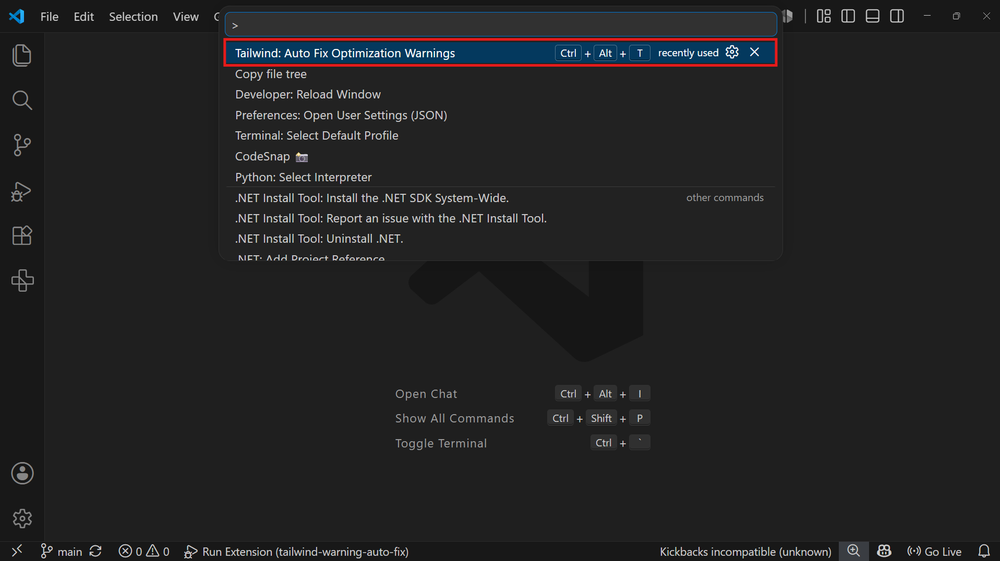

# Tailwind Warning Auto-Fix

Automatically fix every Tailwind CSS optimization warning in the active file with a single command — no more clicking Quick Fix one class at a time.


---

## The Problem

The [Tailwind CSS IntelliSense](https://marketplace.visualstudio.com/items?itemName=bradlc.vscode-tailwindcss) extension frequently flags optimization opportunities like:

```
The class `max-w-[1600px]` can be written as `max-w-400`
The class `!bg-surface` can be written as `bg-surface!`
```

Fixing these one at a time via the lightbulb Quick Fix menu is tedious in any file with more than a handful of warnings.

## The Solution

**Tailwind Warning Auto-Fix** reads every optimization warning already produced by Tailwind CSS IntelliSense in the active file and applies all suggested fixes at once, atomically, with full undo support.

It does **not** reimplement Tailwind's optimization logic — it's a thin, safe automation layer over diagnostics that already exist.

---

## Features

- ✅ Fixes **all** Tailwind optimization warnings in the active file with one command
- ✅ Applies every replacement in a single `WorkspaceEdit` — one Undo (`Cmd/Ctrl+Z`) reverts everything
- ✅ Uses each diagnostic's exact source range — never a document-wide text search, so it's safe even when the same class string appears multiple times in a file
- ✅ Works in any file type supported by Tailwind CSS IntelliSense (JS, TS, JSX, TSX, HTML, Vue, Astro, Svelte, PHP, Blade, MDX, and more) — no hardcoded language list
- ✅ Confirms before applying, and reports a clear summary afterward
- ✅ Gracefully skips and reports any warning it can't safely parse, instead of failing the whole batch




---

## Requirements

- Visual Studio Code `^1.90.0` or later
- The [Tailwind CSS IntelliSense](https://marketplace.visualstudio.com/items?itemName=bradlc.vscode-tailwindcss) extension installed and active (this extension only reads its diagnostics — it does not analyze Tailwind classes itself)

---

## Installation

### From the Marketplace

1. Open the Extensions view in VS Code (`Cmd/Ctrl+Shift+X`).
2. Search for **Tailwind Warning Auto-Fix**.
3. Click **Install**.

### From a `.vsix` file

```bash
code --install-extension tailwind-warning-auto-fix-0.0.1.vsix
```

---

## Usage

Open a file containing Tailwind classes with active optimization warnings (visible in the Problems panel), then trigger the fix in any of three ways:

- **Command Palette** — `Cmd/Ctrl+Shift+P` → run `Tailwind: Auto Fix Optimization Warnings`
- **Keyboard shortcut** — `Ctrl+Alt+T` (Windows/Linux) or `Cmd+Alt+T` (Mac), while focused in the editor
- **Status bar button** — click **✨ Tailwind Fix** in the bottom-right status bar

All three trigger the identical flow:

1. Review the confirmation dialog showing how many warnings were found.
2. Click **Apply**.
3. A summary notification confirms how many fixes were applied (and how many, if any, were skipped).

> **Rebinding the shortcut:** if `Ctrl+Alt+T`/`Cmd+Alt+T` conflicts with another shortcut or your OS (some Linux distributions bind this to opening a terminal), open **Keyboard Shortcuts** (`Cmd/Ctrl+K Cmd/Ctrl+S`), search for "Tailwind: Auto Fix Optimization Warnings", and rebind it to whatever you prefer.

### What you'll see

| Situation                            | Message                                                                 |
| ------------------------------------ | ----------------------------------------------------------------------- |
| No file open                         | `Open a file first.`                                                    |
| No optimization warnings in the file | `No Tailwind optimization warnings found.`                              |
| Warnings found                       | `Found 18 Tailwind optimization warnings. Apply all fixes?`             |
| All fixes applied                    | `Successfully fixed 18 Tailwind optimization warnings.`                 |
| Some warnings unparsable             | `18 fixes applied. 2 warnings skipped because they couldn't be parsed.` |

---

## Commands

| Command                                    | Shortcut                   | Description                                                                                                                                            |
| ------------------------------------------ | -------------------------- | ------------------------------------------------------------------------------------------------------------------------------------------------------ |
| `Tailwind: Auto Fix Optimization Warnings` | `Ctrl+Alt+T` / `Cmd+Alt+T` | Scans the active file's diagnostics and fixes every Tailwind optimization warning found. Also available via the **✨ Tailwind Fix** status bar button. |

---

## Settings

| Setting                                    | Type    | Default | Description                                             |
| ------------------------------------------ | ------- | ------- | ------------------------------------------------------- |
| `tailwindAutoOptimizer.confirmBeforeApply` | boolean | `true`  | Show a confirmation dialog before applying all fixes    |
| `tailwindAutoOptimizer.showSummary`        | boolean | `true`  | Show a summary notification after fixes are applied     |
| `tailwindAutoOptimizer.autoFixOnSave`      | boolean | `false` | Reserved for a future release — currently has no effect |

---

## How It Works

This extension never re-implements Tailwind's class-optimization logic, parses JSX, or builds an AST. Instead, for each diagnostic in the active file, it:

1. Reads existing diagnostics via `vscode.languages.getDiagnostics()` — no document scanning.
2. Filters to those matching Tailwind CSS IntelliSense's optimization-warning format.
3. Extracts the original and suggested class names from the diagnostic message text.
4. Replaces text using the diagnostic's own `range` — never a text search — so the correct occurrence is always targeted, even with duplicate class names elsewhere in the file.
5. Batches every replacement into one `WorkspaceEdit` and applies it atomically.

---

## Known Limitations

- Only processes the **currently active file** — workspace-wide or folder-wide fixing is on the roadmap (see below).
- Relies entirely on Tailwind CSS IntelliSense's diagnostics; if that extension is disabled or hasn't finished analyzing the file yet, no warnings will be found.
- If Tailwind CSS IntelliSense changes its warning message wording in a future release, parsing may need an update (tracked in a single, isolated file — see Contributing).
- Diagnostics with overlapping source ranges (should not normally occur) are conservatively excluded rather than risking a corrupted edit.

---

## Roadmap

Planned for future versions:

- [ ] Auto Fix on Save
- [ ] Workspace-wide "Fix All" command
- [ ] Folder-level fixing
- [ ] Multi-root workspace support
- [ ] `CodeActionProvider` integration (fix warnings via the lightbulb menu directly)
- [ ] Fix All Quick Fix action
- [ ] Status bar button
- [ ] Progress notification for large files
- [ ] Marketplace icon and branding polish
- [ ] Optional telemetry
- [ ] Localization
- [ ] Unit and integration test suite
- [ ] CI/CD via GitHub Actions
- [ ] Semantic release automation

---

## Development

### Setup

```bash
git clone https://github.com/your-publisher-name/tailwind-warning-auto-fix.git
cd tailwind-warning-auto-fix
npm install
```

### Build

```bash
npm run compile      # one-time build
npm run watch         # incremental rebuild on file changes
```

### Debug

1. Open the project in VS Code.
2. Press `F5` to launch the Extension Development Host.
3. Open a file with Tailwind classes in the new window and run the command.

### Lint

```bash
npm run lint
```

### Package

```bash
npm run package
```

Produces a `.vsix` file in the project root.

---

## Publishing

```bash
npx vsce login <publisher-name>
npx vsce publish
```

See [VS Code's official publishing guide](https://code.visualstudio.com/api/working-with-extensions/publishing-extension) for full details on creating a publisher and Personal Access Token.

---

## Contributing

Contributions are welcome. Please:

1. Open an issue describing the bug or feature before submitting a large PR.
2. Keep changes scoped — this project favors small, focused modules (see architecture below).
3. Run `npm run lint` and `npm run compile` before submitting.
4. Match the existing code style (strict TypeScript, no `any`, no unused code).

### Architecture Overview

```
src/
├── commands/       # Orchestrates user-triggered flows
├── services/       # Diagnostics reading, replacement building, config access
├── parsers/        # Pure, dependency-free message parsing
├── utils/          # Logging and notification helpers
├── types/          # Shared interfaces
├── constants/      # Messages, regex patterns, command IDs
└── extension.ts    # Composition root (activate/deactivate)
```

---

## License

MIT — see [LICENSE](./LICENSE).
